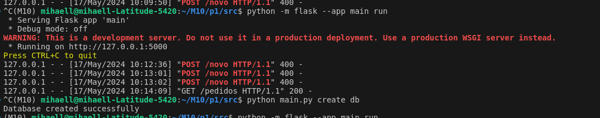

# Prova 1 M10

Implementação simples de uma api em Flask para gerenciamento de pedidos


## Execução do projeto 

Para executar primeiramente crie e rode um ambiente virtual com os comandos

```
python -m venv .
source ./bin/activate
```

Com o repositório clonado acesse a pasta p1 e build a imagem

```
docker build --tag 'prova1' .
```

e rode 
```
docker run 'prova1'
```

## log

