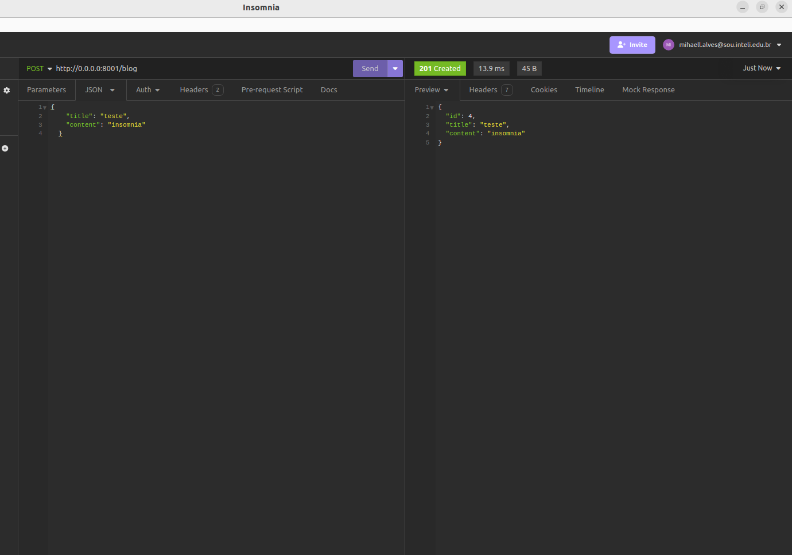
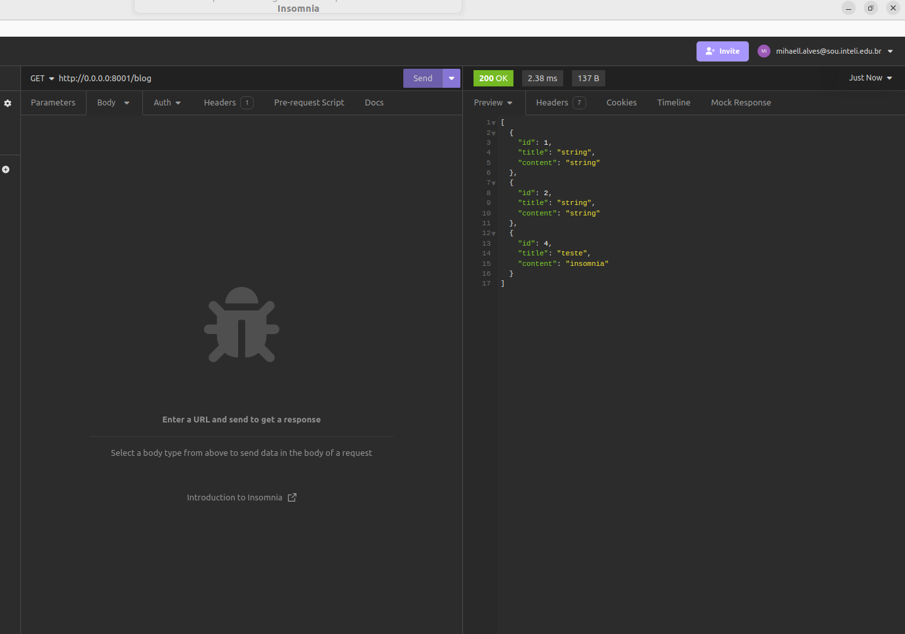

# Prova 2 M10

Implementação de um sistema de blog post com fastAPI com sistema de log e gateway


## Execução do projeto 

Com o repositório clonado acesse a pasta p2 e build a imagem

```
docker build --tag 'p2' .
```

e rode 
```
docker run 'p2'
```

## Resultados
### Teste das rotas no Insomina



### Sistema de Logs


### Docker e gateway

