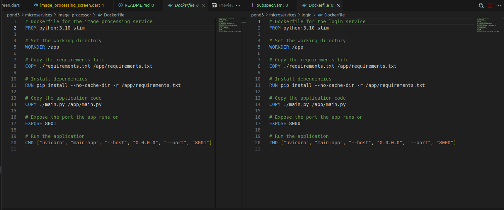

# Ponderada 3 - App de processamento de imagens com Flutter

O repositório contém a implementação de um APP Flutter que recebe uma imagem da galeria do Device e envia para o backend processar, aplicando um filtro de contorno

## Backend em Microsserviços

### Login 
Este serviço gerencia o registro e login de usuários no banco de dados do proprio serviço. Ele possui duas rotas principais:

- Registro de Usuário (POST /register/): Registra um novo usuário com username e password.
- Login de Usuário (POST /login/): Verifica as credenciais fornecidas e, se válidas, permite o acesso.

### Processamento de Imagem
Este serviço recebe uma imagem, aplica um filtro e retorna a imagem processada. Ele possui uma rota principal:

- Processamento de Imagem (POST /process_image/): Recebe uma imagem, aplica um filtro (contorno) e retorna a imagem processada.

### Docker Files



## Docker Compose
No arquivo 'docker-compose' definimos os serviços de login e processamento de imagem que consumirão dos docker files respectivos. Setamos portas e definimos uma rede comum para comunicação entre eles.


## Flutter

O aplicativo possui uma tela de login e de registro que são muito semelhantes e uma tela para seleção e processamento de imagem. Ao ser processada a imagem sera mostrada na mesma tela

## Instruções para executar o projeto

Na pasta de microservices, execute:
```
docker-compose up --build
```

em outro terminal va ate a pasta image_processor_app e execute:

```
flutter pub get
flutter run
```

## Resultados

LInk do video