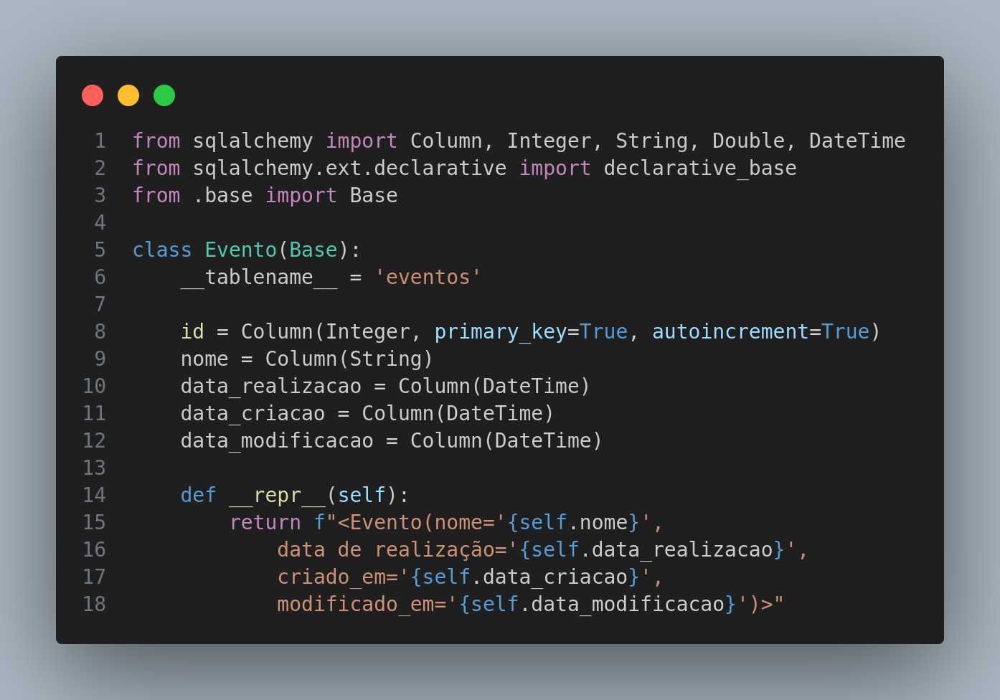
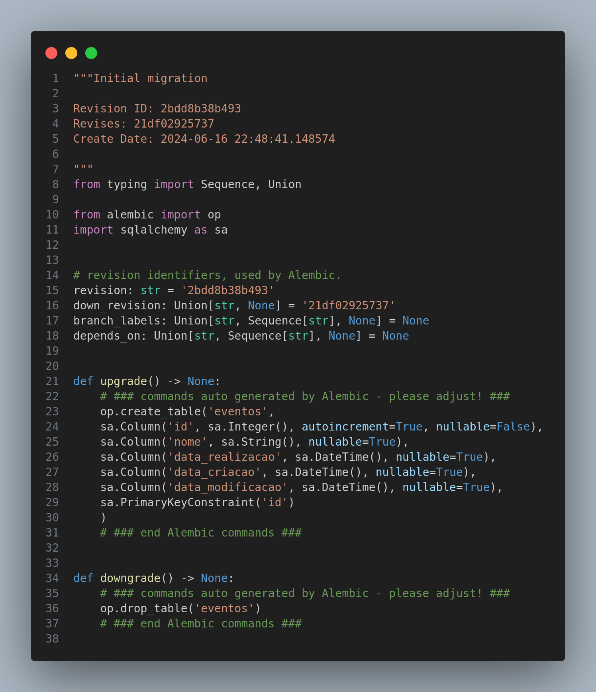
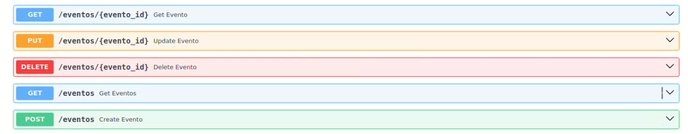
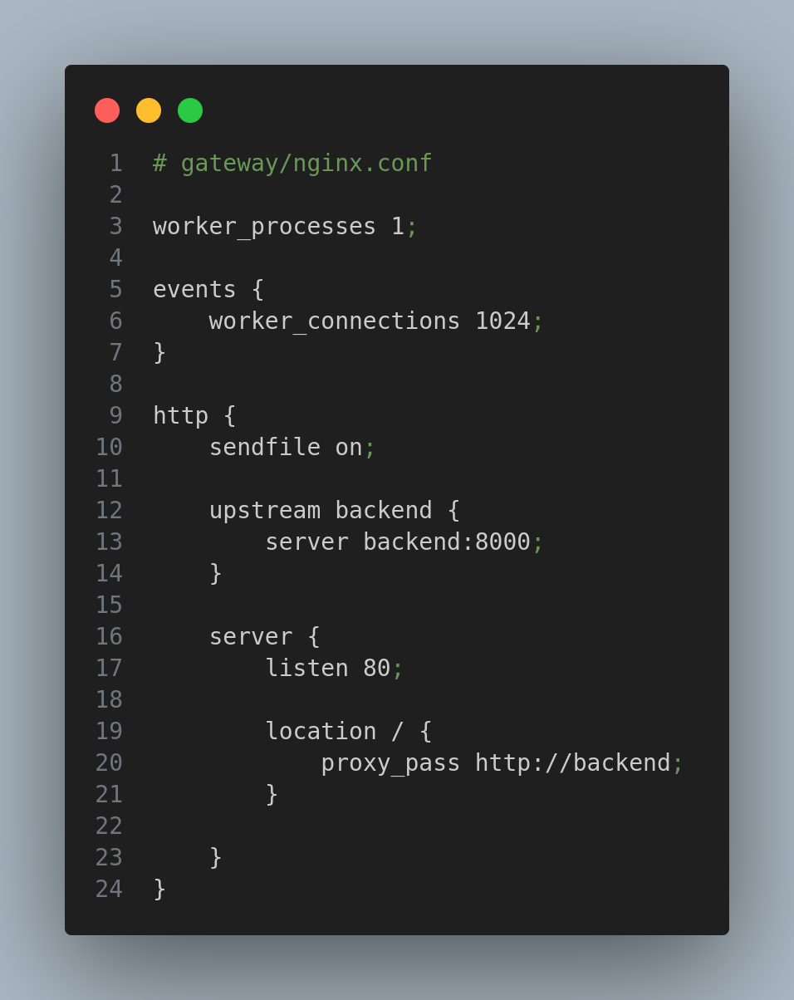
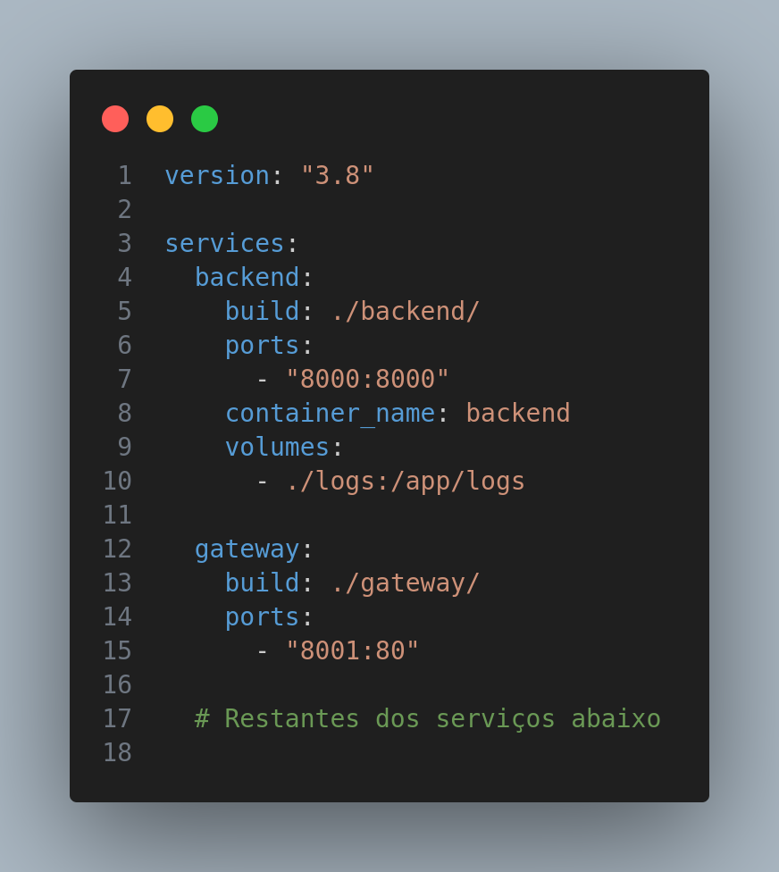

# Ponderada 4 - App de processamento de imagens com Flutter

O repositório contém a implementação de um serviço de eventos de gerenciamentos de eventos e a adição de um gateway para redirecionamento de requests

## Backend

O backend foi baseado no projeto disponibilizado nesse repositório [base ponderada 4](https://github.com/Murilo-ZC/M10-Inteli-Eng-Comp/tree/main/src/encontro11/sistema03), e adicionado o serviço de eventos.

### Crud de Eventos 
Este serviço segue a arquitetura da base, com sua implementação repartida pelos diretórios *models, repository, routers, schemas e service*

### Models

O modelo para o banco de dados foi criado com nome e data de realização do evento, além do id. Os campos de data de criação e modificação seguem o padrão para os logs



### Alembic

Para atualização do banco de dados foi utilizado o Alembic, previamente implementado.



### Rotas

CRUD padrão para adição, visualização, atualização e remoção de eventos do banco de usuario



## Gateway

Para essa aplicaçao utilizei o nginx para redirecionar a rota do backend 8000 para 8001

A configuração do nginx:


Sua implementação no docker compose


## Executando aplicação

Vá para a raiz do projeto 'pond4' e execute o docker-compose com:

```
docker-compose up --build
```

## Resultados

[Link da demonstração](https://youtu.be/zYGxTB0SVUg)
